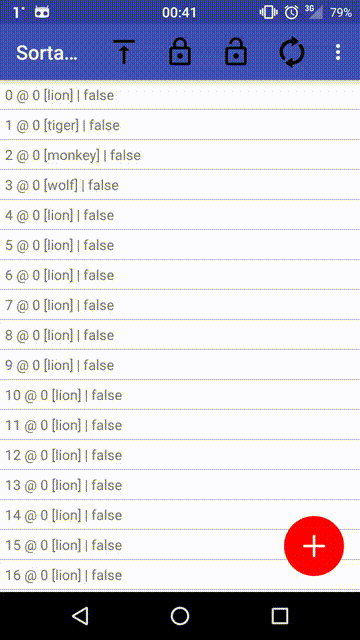

# Crud Item List

Widget to be used for manipulating a collection of items via its own set of
GUI controls meant to manipulate the list.

## Show cases

Add new items:


Remove the items:


Move the items up and down (holding the up/down buttons starts moving the
items continuously):



Edit individual items (one at a time):


Left and right handed menu support:


## Installation

Add the following to your app's **build.gradle**:

    dependencies {
        ...
        compile ('com.gurunars.crud_item_list:crud-item-list:0.+@aar') {
            transitive = true
        }
        ...
    }

## Layouts

Set in layouts:

```xml

    <com.gurunars.crud_item_list.CrudItemList
        app:actionIconFgColor="@color/Yellow"
        app:actionIconBgColor="@color/Blue"
        app:contextualCloseBgColor="@color/Black"
        app:contextualCloseFgColor="@color/White"
        app:createCloseBgColor="@color/Red"
        app:createCloseFgColor="@color/White"
        app:openBgColor="@color/Red"
        app:openFgColor="@color/White"
        android:id="@+id/customView"
        android:layout_width="wrap_content"
        android:layout_height="wrap_content" />

```

The following layout attributes are available:

* **actionIconFgColor** - icon fill of the contextual menu action buttons
* **actionIconBgColor** - background of the contextual menu action buttons
* **contextualCloseFgColor** - icon fill of the contextual menu close button
* **contextualCloseBgColor** - background of the contextual menu close button
* **createCloseFgColor** - icon fill of the creation menu close button
* **createCloseBgColor** - background of the creation menu close button
* **openBgColor** - icon fill of the FAB button when the menus are closed
* **openFgColor** - background of the FAB button when the menus are closed

## Java code

When you are done with the cosmetics configure the content of your list in
the code.

Obtain the list reference:

```java

crudItemList = (CrudItemList<AnimalItem>) findViewById(R.id.customView);

```

Set a callable to be invoked whenever the collection in the list is changed:

```java

crudItemList.setListChangeListener(new ListChangeListener<AnimalItem>() {
    @Override
    public void onChange(List<Item<AnimalItem>> items) {
        for (Item<AnimalItem> item: items) {
            model.updateItem(item);
        }
    }
});

```

Set a callable to be invoked whenever a new item has to be added or an existing
one has to be changed:

```java

crudItemList.setItemEditListener(new ItemEditListener<AnimalItem>() {
    @Override
    public void onEdit(Item<AnimalItem> editableItem, boolean isNew) {
        editableItem.update();
        model.updateItem(editableItem);
        crudItemList.setItems(model.getItems());
    }
});

```

NOTE: as a matter of convenience - there is an ItemSetter.setItem static method
that replaces the item in a collection if its id was found or appends a new
entry otherwise. It is responsibility of the handler to apply the changes
to the view after modifying the payload though.

First, configure the view to be shown when all the items are removed from the
list.

Subclass an EmptyViewBinder:

```java

class EmptyBinder implements EmptyViewBinder {

    @Override
    public View getView(Context context) {
        return LayoutInflater.from(context).inflate(
            R.layout.completely_empty_list, null);
    }

}

```

And assgin it to the item list:

```java

crudItemList.setEmptyViewBinder(new EmptyBinder());

```

Second, configure the views to render individual items in rows.

Implement item view binder:

```java

class AnimalRowBinder extends ItemViewBinder<TextView, SelectableItem<AnimalItem>> {

    @Override
    public TextView getView(Context context) {
        TextView text = new TextView(context);
        int padding = context.getResources().getDimensionPixelOffset(R.dimen.padding);
        text.setPadding(padding, padding, padding, padding);
        return text;
    }

    @Override
    public void bind(TextView view, SelectableItem<AnimalItem> item, @Nullable SelectableItem<AnimalItem> previousItem) {
        view.setBackgroundColor(ContextCompat.getColor(view.getContext(),
                item.isSelected() ? R.color.Red : R.color.White));
        view.setText(item.toString());
        view.setContentDescription("I"+item.getId());

        // Animate created and updated items
        if (previousItem == null) {
            animate(view);
        }
    }

    private void animate(final View view) {
        view.clearAnimation();
        ValueAnimator anim = new ValueAnimator();
        anim.setFloatValues(1.0F, 0.0F, 1.0F);
        anim.addUpdateListener(new ValueAnimator.AnimatorUpdateListener() {
            @Override
            public void onAnimationUpdate(ValueAnimator animation) {
                view.setAlpha((Float) animation.getAnimatedValue());
            }
        });
        anim.setDuration(1300);
        anim.start();
    }

}

```

And assign it to the item list for each item type together with a supplier of
new items and the id of the menu item that is supposed to trigger new item
creation chain of events:

```java

private void confItemType(@IdRes int id, final AnimalItem.Type type) {
    creationMenu.findViewById(id).setOnClickListener(new View.OnClickListener() {
        @Override
        public void onClick(View v) {
            model.createItem(new AnimalItem(type));
            crudItemList.setItems(model.getItems());
        }
    });
    crudItemList.registerItemType(type, new AnimalRowBinder());
}


confItemType(R.id.lion, AnimalItem.Type.LION);
confItemType(R.id.tiger, AnimalItem.Type.TIGER);
confItemType(R.id.monkey, AnimalItem.Type.MONKEY);
confItemType(R.id.wolf, AnimalItem.Type.WOLF);

```

## Creation menu

Configure the menu to be shown when a plus icon is clicked in order to create
a new item. The menu should contain the ids used in registerItemType calls.

```java

crudItemList.setCreationMenu(View.inflate(this, R.layout.create_layout, null));

```

## Setting the items

Whenever you need to change the displayed data just set it to a new collection.
The ItemList will handling animations and selection retention on its own.

```java

crudItemList.setItems(new ArrayList<AnimalItem>());

```

## Additional behavior customization

You maý disable sorting of the items (i.e. no moving up and down) via:

```java

itemList.setSortable(false)

```

You may also change the dominant hand for the fab menu to move the controls to
the left edge of the screen.

```java

itemList.setLeftHanded(true)

```

## API

Check [javadoc](https://gurunars.github.io/android-crud-ui/crud-item-list/).