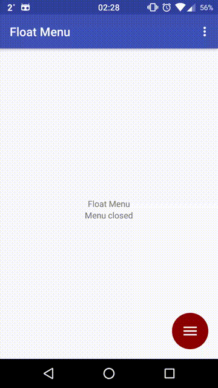

# Module floatmenu

The menu is opened with multiple animations via a button click:

The menu can be toggled externally:

There is a support for both left and right handed people:

The menu has two modes: with and without a background layover. With it the all
the clicks in semi-transparent gray area are blocked. Without it any clicks are
passed to the layer below the menu.

