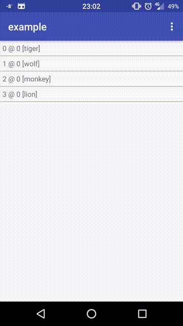

# Item List

A RecyclerView based widget to simplify the item list changes' animations.

The way it differs from plain RecyclerView is by exposing only a single
interface method to manipulate the payload - **setItems**. All animations
and adapter management is done inside the view as an implementation detail.

## Installation

Add the following to your app's **build.gradle**:

    dependencies {
        ...
        compile ('com.gurunars.item_list:item-list:0.+@aar') {
            transitive = true
        }
        ...
    }

## Regular item List

A basic list view for a regular collection of items.

Showcase:



First, implement a payload interface:

```java
import com.gurunars.item_list.Payload;

class AnimalPayload implements Payload {

    private int version;
    private Type type;

    @Override
    public Enum getType() {
        return type;
    }

    enum Type {
        MONKEY, TIGER, WOLF, LION
    }

    public void update() {
        this.version++;
    }

    public AnimalPayload(int version, Type type) {
        this.version = version;
        this.type = type;
    }

    @Override
    public String toString() {
        return "" + type + " @ " + version;
    }
}
```

Put the following into your layout file:

```xml

<com.gurunars.item_list.ItemList
    android:id="@+id/itemList"
    android:layout_width="match_parent"
    android:layout_height="match_parent" />

```

Implement the renderer:

```java

class AnimalBinder implements ItemViewBinder<AnimalPayload> {

    @Override
    public View getView(Context context) {
        TextView text = new TextView(context);
        int padding = context.getResources().getDimensionPixelOffset(R.dimen.padding);
        text.setPadding(padding, padding, padding, padding);
        return text;
    }

    @Override
    public void bind(View itemView, Item<AnimalPayload> item, @Nullable Item<AnimalPayload> previousItem) {
        ((TextView) itemView).setText(item.toString());
        if (previousItem != null) {
            animateUpdate(itemView);
        }
    }

    private void animateUpdate(final View view) {
        view.clearAnimation();
        ValueAnimator anim = new ValueAnimator();
        anim.setFloatValues((float) 1.0, (float) 0.0, (float) 1.0);
        anim.addUpdateListener(new ValueAnimator.AnimatorUpdateListener() {
            @Override
            public void onAnimationUpdate(ValueAnimator animation) {
                view.setAlpha((Float) animation.getAnimatedValue());
            }
        });
        anim.setDuration(1300);
        anim.start();
    }

}

```

If you don't implement the renderer - the default one shall be used - a plain
text view showing the string returned by a **toString()** method of the Item
instance.

Note, bind method gets an item to render now and a previous version of the
item. I.e. the item with the same id but with a different payload. It can be
null in case if the item did not exists before - i.e. if it just was created.

Implement the empty page renderer:

```java

class EmptyBinder implements EmptyViewBinder {

    @Override
    public View getView(Context context) {
        TextView view = new TextView(context);
        view.setGravity(Gravity.CENTER);
        view.setText(R.string.empty);
        return view;
    }

}

```

In your component place the following configs:

```java

// obtain the view from a layout

ItemList<TestItem> itemList = (ItemList<TestItem>) findViewById(R.id.itemList);

// set renderer for each type

itemList.registerItemViewBinder(AnimalItem.Type.LION, new AnimalBinder());
itemList.registerItemViewBinder(AnimalItem.Type.MONKEY, new AnimalBinder());
itemList.registerItemViewBinder(AnimalItem.Type.TIGER, new AnimalBinder());
itemList.registerItemViewBinder(AnimalItem.Type.WOLF, new AnimalBinder());

// set empty page renderer

itemList.setEmptyViewBinder(new EmptyBinder());

```
And finally set the collection to a specific set of items:

```java

itemList.setItems(Arrays.asList(
    new Item<>(0, new AnimalPayload(0, AnimalItem.Type.LION)),
    new Item<>(1, new AnimalPayload(0, AnimalItem.Type.MONKEY)),
    new Item<>(2, new AnimalPayload(0, AnimalItem.Type.TIGER)),
    new Item<>(3, new AnimalPayload(0, AnimalItem.Type.WOLF))
));

```

Note, the widget retains the collection of items in its internal state thus
whenever you invoke setItems method again a new list is diffed against
the old one and proper animations are invoked visualizing the changes.

## Selectable item list

An item list with a possibility to select items by clicking them.

To initiate the selection mode the first item has to be long-clicked.

In the selection mode clicking the items selects/unselects them.

Showcase:


Payload has the same structure as the one for a regular item list.

Though in your layout file put the following:

```xml

<com.gurunars.item_list.SelectableItemList
    android:id="@+id/selectableItemList"
    android:layout_width="match_parent"
    android:layout_height="match_parent" />

```

Later on implement a view renderer:

```java

static class AnimalBinder implements ItemViewBinder<SelectablePayload<AnimalPayload>> {

    @Override
    public View getView(Context context) {
        TextView text = new TextView(context);
        int padding = context.getResources().getDimensionPixelOffset(R.dimen.padding);
        text.setPadding(padding, padding, padding, padding);
        return text;
    }

    @Override
    public void bind(View itemView, Item<SelectablePayload<AnimalPayload>> item, @Nullable Item<SelectablePayload<AnimalPayload>> previousItem) {
        ((TextView) itemView).setText("" + item);
        itemView.setBackgroundColor(item.getPayload().isSelected() ? Color.RED : Color.WHITE);
        if (previousItem != null) {
            animateUpdate(itemView);
        }
    }

    private void animateUpdate(final View view) {
        view.clearAnimation();
        ValueAnimator anim = new ValueAnimator();
        anim.setFloatValues((float) 1.0, (float) 0.0, (float) 1.0);
        anim.addUpdateListener(new ValueAnimator.AnimatorUpdateListener() {
            @Override
            public void onAnimationUpdate(ValueAnimator animation) {
                view.setAlpha((Float) animation.getAnimatedValue());
            }
        });
        anim.setDuration(1300);
        anim.start();
    }

}

```

The way it differs from the regular view renderer is by having **SelectablePayload**
wrapper around your own payload.

Empty view binder is exactly the same as the one for a regular list.

The means to manipulate the item list are exactly the same as for a regular list
with the exception that there are two extra methods: **setSelectedItems** and
**getSelectedItems** to manipulate the selection externally.

```java

itemList.setSelectedItems(new HashSet<Item<AnimalPayload>>());
Set<Item<AnimalPayload>> selection = itemList.getSelectedItems();

```

Also there is an option to add a listener for list's selection change events:

```java

itemList.setSelectionChangeListener(new Runnable() {
    @Override
    public void run() {
        // process selection state change events
    }
});

```

which shall be called whenever the internal state of individual items gets
changed.

## API

Check [javadoc](https://gurunars.github.io/android-crud-ui/item-list/).
